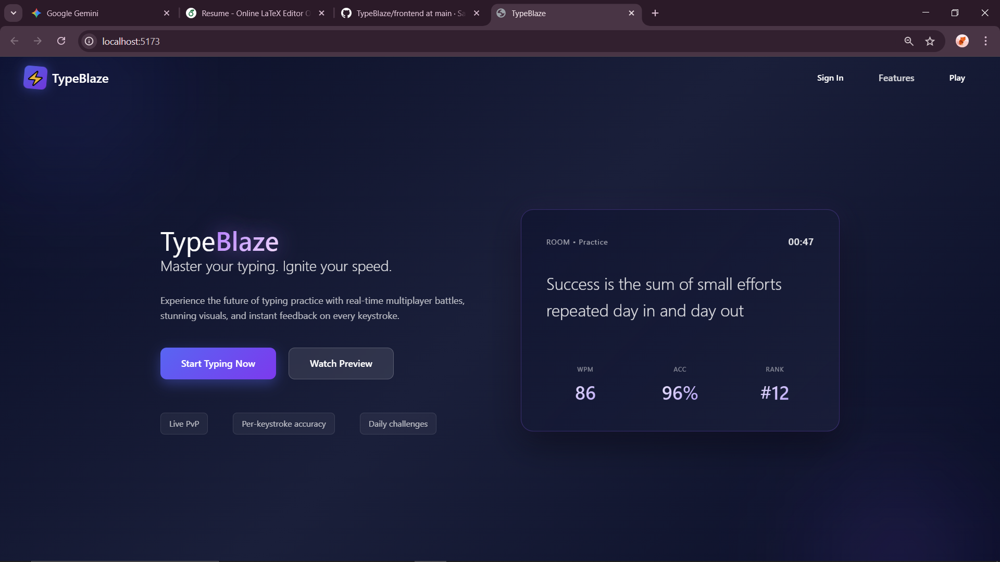
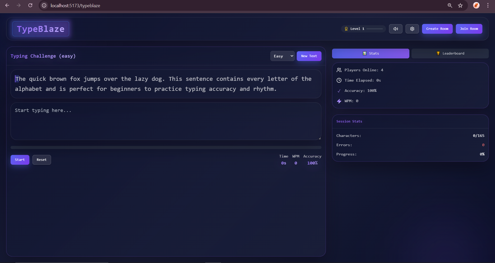

# TypeBlaze ⚡
**TypeBlaze** is a high-performance, real-time multiplayer typing platform. Compete with friends, track your WPM in real-time, and master your typing speed with an immersive UI.

---

## 📸 Project Showcase

### 🏠 Landing Page
Master your typing speed with our modern dashboard.
<br/>



<br/>
<br/>

### ⌨️ Main Typing UI
Real-time stats including WPM, Accuracy, and Progress tracking.
<br/>



<br/>
<br/>

### 🛠️ Create Room
Start a private session and choose your difficulty level.
<br/>


<br/>
<br/>

### 👥 Join Room
Enter a 6-digit code to compete against your friends.
<br/>


---

## 📂 Project Structure

```text
typeblaze/
├── backend/                # Node.js / Express Server
│   ├── .env                # Private API keys (Hidden)
│   └── server.js           # Main entry point
├── frontend/               # React.js / Vite Client
│   ├── .env                # Public API URLs (Hidden)
│   └── src/                # UI Components
├── screenshot/             # Project UI Images
│   ├── landing.png
│   ├── ui.png
│   ├── create.png
│   └── join.png
├── .gitignore              # Hides .env & node_modules
└── README.md               # Documentation


🚀 Key Features
Real-time Multiplayer: Compete using unique 6-digit room codes.

Live Analytics: Instant feedback on WPM and Accuracy.

Difficulty Tiers: Easy, Medium, and Hard challenges.

Modern UI: Immersive dark-themed interface for maximum focus.


🛠️ Setup Instructions

1. Environment Configuration
Create .env files in both folders (these are ignored by Git for security):

Frontend (/frontend/.env): VITE_API_URL=http://localhost:5000

Backend (/backend/.env): PORT=5000


2. Installation
Start Backend:

Bash

cd backend
npm install
npm start
Start Frontend:

Bash

cd frontend
npm install
npm run dev
